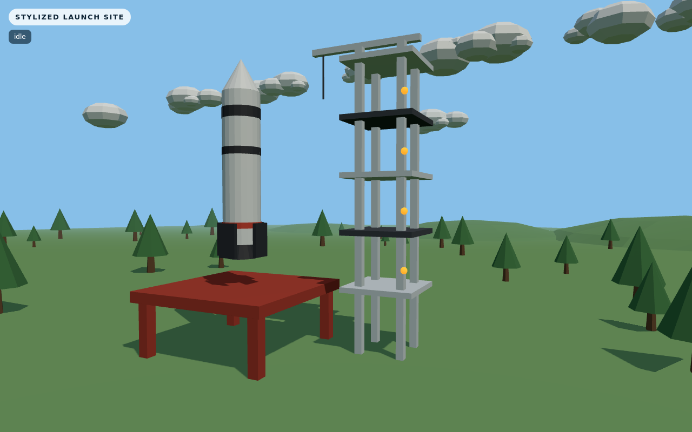
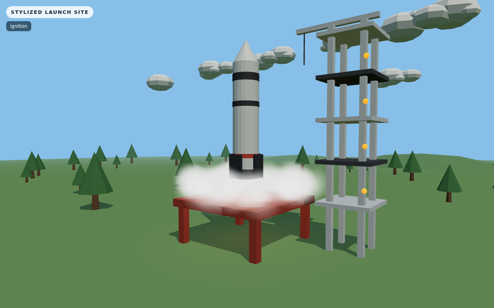
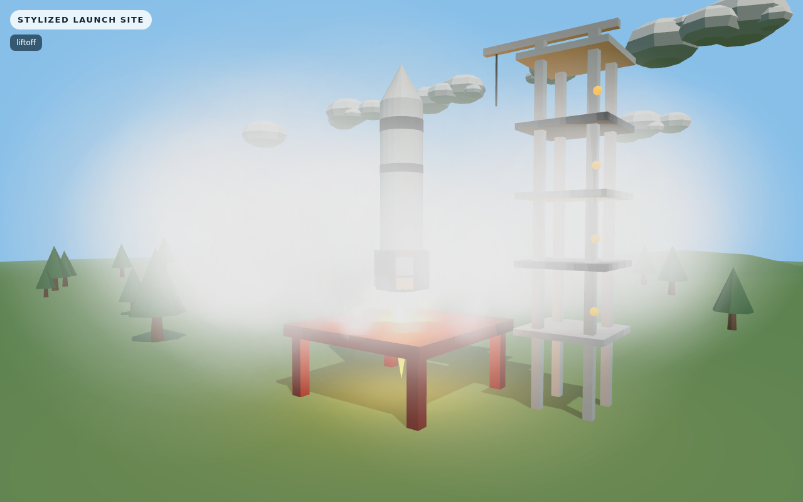
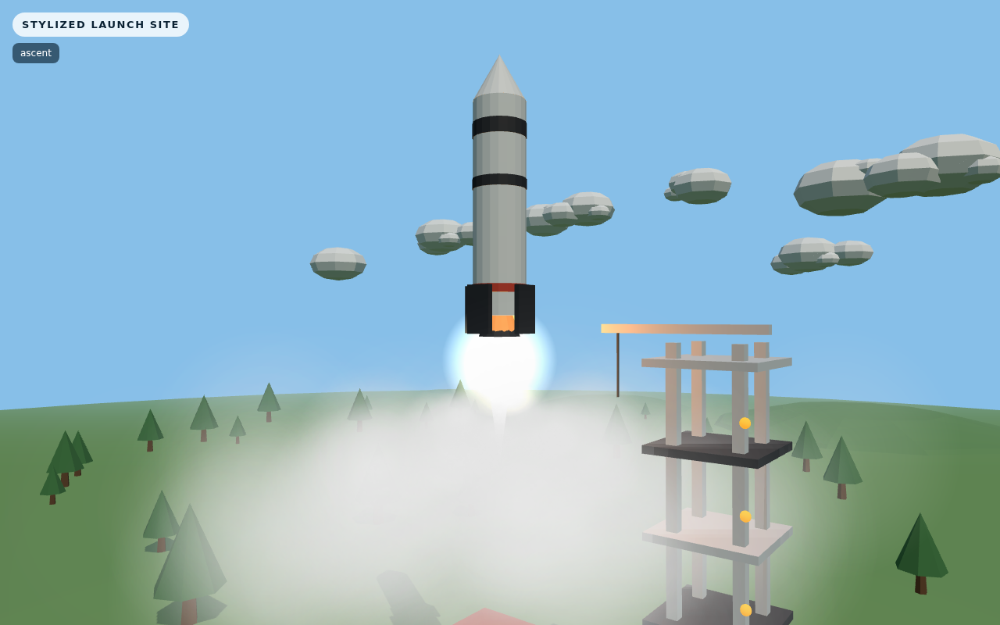
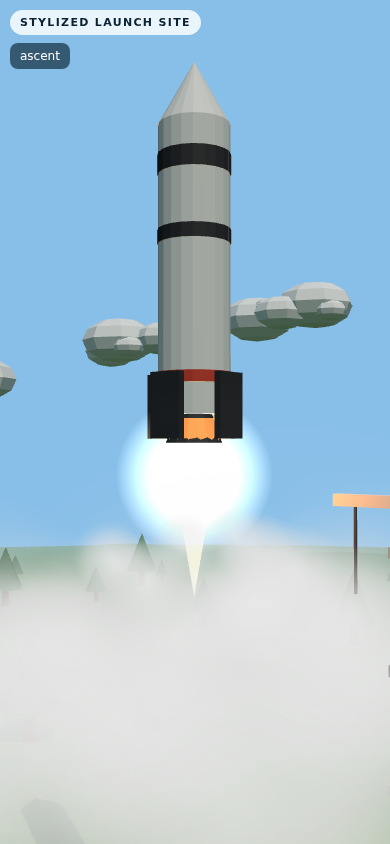

# 3D Rocket Launch Experience

A stylized, auto-looping 3D rocket launch in the browser. A procedural rocket sits on a red truss pad next to a service tower, then ignites, lifts off through expanding exhaust smoke, and accelerates skyward while the camera smoothly transitions from a ground-level view to an upward tracking shot. No input needed — it plays and loops on load.

## Launch sequence (~22s loop)

1. **Idle** — rocket stationary on the pad, service tower, trees, drifting clouds
2. **Ignition** — engine glow ramps up, smoke bursts and spreads radially across the pad
3. **Liftoff** — slow initial rise clearing the tower, heavy exhaust plume
4. **Ascent** — accelerating climb with the camera tilting up and following
5. **Reset** — loop restarts seamlessly at the pad

## Tech stack

- Vite + React (UI shell, HUD status overlay)
- Plain Three.js, imperative scene modules in `src/three/` (no R3F)
- All geometry procedural, smoke texture generated on an offscreen canvas — zero external assets
- Vitest for the sequence state-machine tests, `agent-browser` CLI for browser QA

## Run it locally

```bash
npm install
npm run dev     # http://127.0.0.1:5173
```

| Command        | Description              |
| -------------- | ------------------------ |
| `npm run dev`  | Start dev server         |
| `npm test`     | Run unit tests           |
| `npm run build`| Production build (`dist/`) |
| `npm run preview` | Preview the build     |

## Architecture

- `src/components/LaunchScene.jsx` — renderer, lights, ground, animation loop, resize/visibility handling
- `src/three/buildRocket.js` — procedural rocket (body, nose, bands, fins, engine bell)
- `src/three/buildLaunchSite.js` — pad truss, deck, tower with platforms, crane, lights
- `src/three/buildEnvironment.js` — instanced trees, drifting clouds, hills, fog
- `src/three/effects.js` — flame cones, glow sprite, engine light, pooled billboard smoke
- `src/three/sequence.js` — time-based phase machine (`idle → ignition → liftoff → ascent → reset`)
- `src/three/cameraRig.js` — damped ground-to-tracking camera

Performance is kept smooth via instancing, shared materials, a capped sprite pool (~220), a single shadow-casting light, and pixel ratio capped at 2.

## QA / Verification

Verified results from the current session:

- `npm test`: **4/4 passing**
- `npm run build`: **exit 0**
- Browser flow verified phase-by-phase (`idle → ignition → liftoff → ascent`), including flame and smoke effects
- No browser errors observed (console shows only two benign Three.js deprecation warnings)
- Mobile layout verified at **390×844** with no overflow

Screenshots captured with `agent-browser` against the production build at 1280×800 (mobile at 390×844):











Known limitation: in `idle` the rocket floats slightly above the pad (its base offset needs a spec amendment) — visible in the idle shot.
